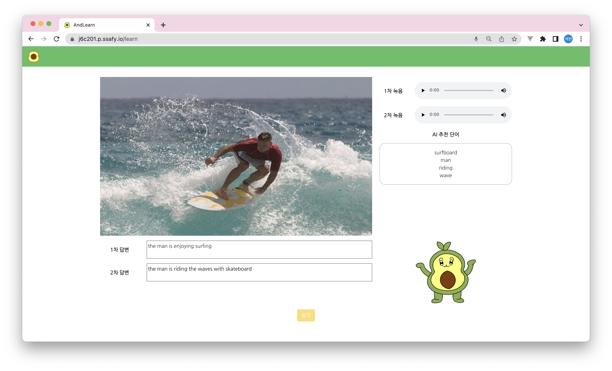
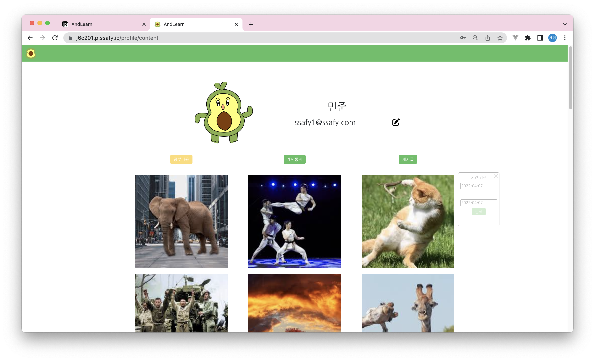
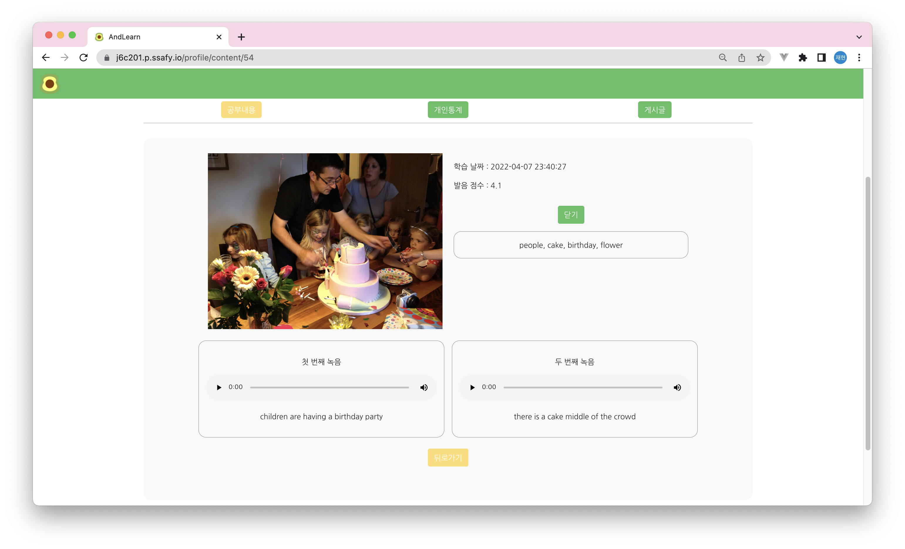
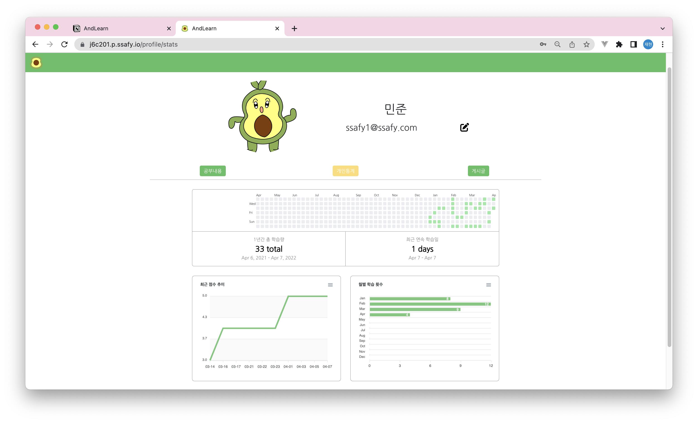
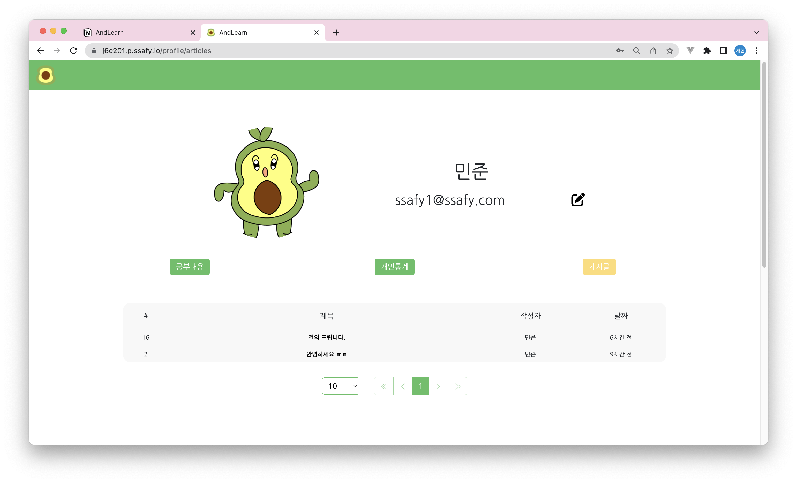
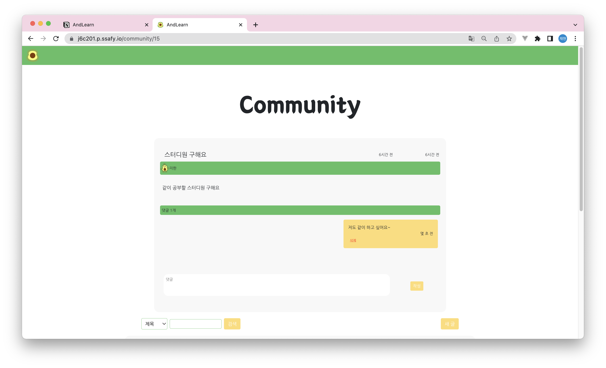
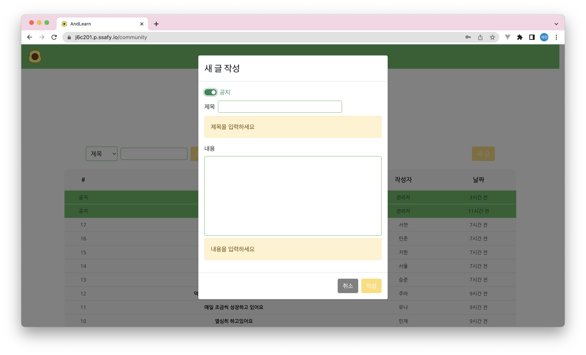
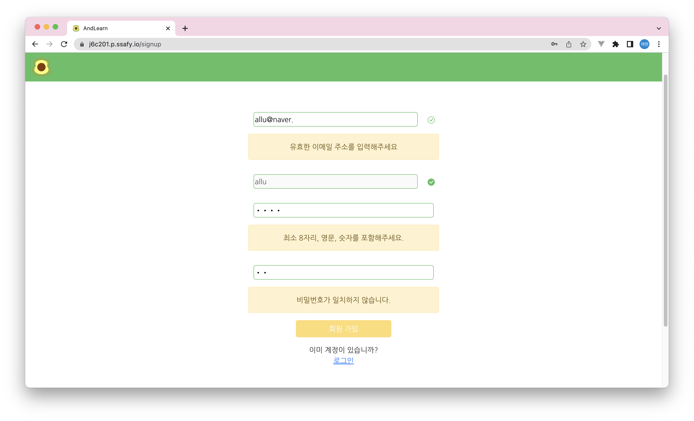
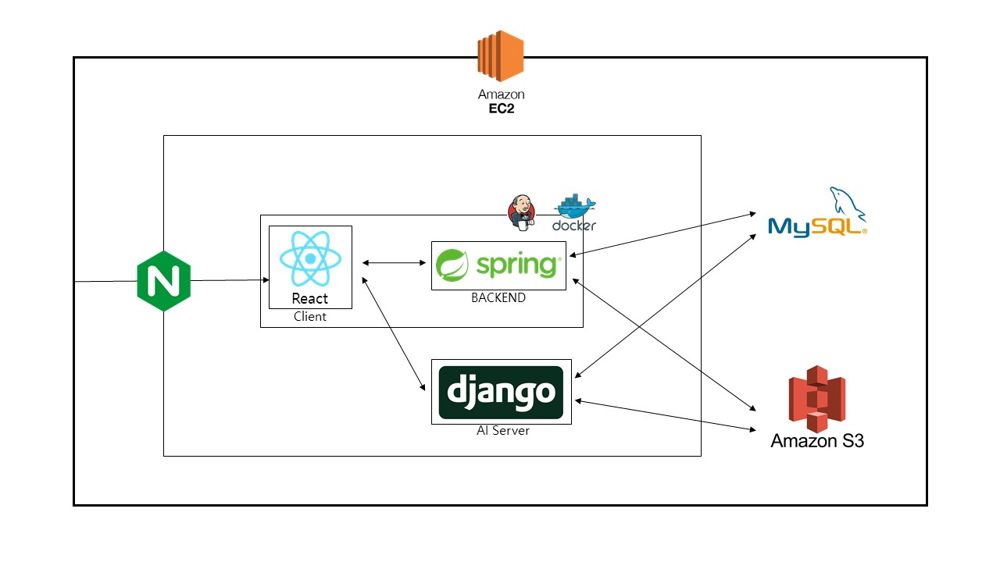
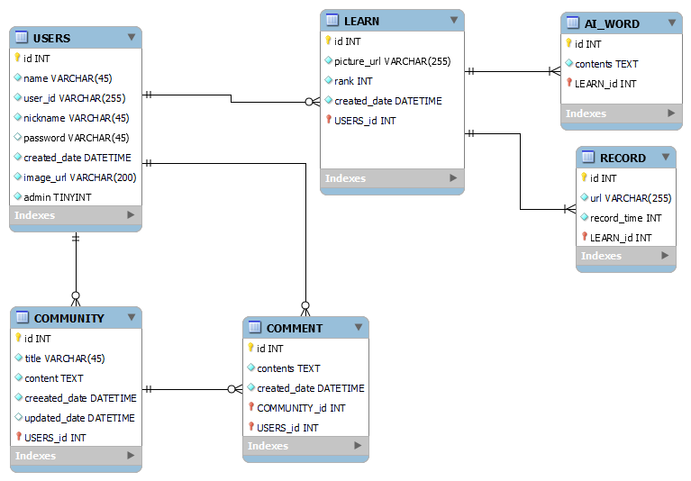

# AndLearn


## ✅ 프로젝트 소개

: **보고 생각하고 묘사하며 영어를 배우는 AI 기반 학습 서비스**

- 기획 배경
    - AI를 이용해서 공부와 교육에 도움을 줄 수 있을까?
    - 영어와 친해지고 싶은 사람을 위한 서비스

- 기대 효과
    - 묘사하는 능력 향상
      
        본인이 원하는 이미지를 보고 생각하며 직접 묘사해보며 상황 파악을 하고 설명하는 능력들을 향상시킬 수 있습니다.
        
    - 말하는 능력 향상
      
        설명을 하며 만들어낸 단어들을 문장으로 직접 말하고 녹음합니다. 녹음한 내용을 다시 들으면서 발음과 비문 여부를 생각하게 됩니다. 반복적인 학습으로 말하는 능력을 향상시킬 수 있습니다.
        
    - 언어를 학습하는 방법 습득
      
        반복적인 행동들로 인해 언어를 학습하는 방법, 이미지를 보며 단어를 생각하며 문장을 구성하는 과정을 통해 언어를 학습하는 방법, 이미지에서 보이는 상황들을 생각하며 언어로 표현하며 학습하는 방법들을 자연스럽게 습득할 수 있습니다. 
        
    
- 마스코트 (ALLU) - 자체 제작 이미지


## ✅ 주요 기능

### 1. LEARN

- 사진 업로드 전


- 학습을 원하는 사진 업로드한다.


- 녹음 버튼 클릭한다.


- 사진을 보고 묘사하며 1차 녹음 진행한다.


- 1차 녹음 후 재녹음을 선택할 수 있고 재녹음이 필요없다면 녹음 확인을 클릭한다.


- 1차 녹음본에서 STT로 생성된 1차 답변을 확인하고 내 녹음과 생성된 답변이 서로 다른 부분이 있으면 수정한다. → AI 추천 단어를 활용하여 2차 녹음을 진행한다.


- 2차 녹음 완료 후 재녹음을 선택할 수 있고 재녹음이 필요 없다면 녹음 확인을 클릭한다.


- 2차 녹음본에서 STT로 생성된 2차 답변을 확인하고 내 녹음과 생성된 답변이 서로 다른 부분이 있으면 수정한다.



### 2. Profile

- 사용자가 지금까지 학습한 사진들을 보여주며 기간 검색을 통해 특정 기간에 학습한 사진들을 검색할 수 있다.



- 사진을 클릭하여 상세 페이지로 들어가면 학습을 진행한 날짜, AI 추천 단어, 사용자의 1차 / 2차 녹음, 답변을 볼 수 있다.



- 사용자의 학습 통계량을 볼 수 있다. 1년간 총 학습량, 최근 연속 학습일, 최근 발음 점수 추이, 월별 학습 횟수를 한눈에 볼 수 있다.



- 사용자가 community에 쓴 자신의 게시글을 볼 수 있다.



### 3. Community

- 사용자들끼리 자유롭게 의견을 나눌 수 있는 공간이며 관리자가 작성한 공지사항이 상단에 위치한다.


- 게시글 상세 페이지로 들어가면 제목과 내용을 볼 수 있고 댓글을 작성할 수 있다.



- 관리자 계정으로 새 글 작성시 공지사항으로 설정할 수 있는 토글 스위치가 나타난다.



### 4. User

- 회원가입시 유효한 이메일 주소인지, 비밀번호가 최소 8자리/영문/숫자를 포함하는지, 비밀번호가 일치하는지 확인을 거친다.




## ✅ 서비스 아키텍쳐




## ✅ ERD




## ✅ 개발 환경

| Backend | Frontend | AI | CI/CD |
| --- | --- | --- | --- |
| IntelliJ | VS code | Django | AWS EC2 |
| spring boot  | React 17.0.2 | Tensorflow | Docker |
| Spring Security | React Bootstrap 2.2.1 |  | nginx |
| Java 11 | React-Router-Dom 6.2.2 |  | Jenkins |
| MySQL | ApexCharts 3.35.0 |  |  |
| Swagger | Styled-Components 5.3.3 |  |  |

### Backend

- JWT를 통해 로그인 구현
    - 이메일, 비밀번호 입력받아 로그인을 진행 → 로그인 controller에서는 입력 받은 이메일과 비밀번호가 데이터베이스에 있는 정보와 일치하는지 확인하고 일치한다면 JWT 토큰을 생성해 프론트엔드에 전송→ 프론트엔드에서 JWT를 local storage에 저장 → 프론트엔드에서 백엔드로 API 요청을 보낼 때는header에 JWT를 포함하여 전송
    - JWT 생성 과정: 토큰 제목(subject), 토큰 만료 시간(expriredAt), 토큰 발급자(issuer), 토큰 발급 시간(issuedAt), 사용할 암호화 알고리즘(sign) 등의 정보를 넣어 토큰을 생성

```java
public static String getToken(String userId) {
      Date expires = JwtTokenUtil.getTokenExpiration(expirationTime);
    return JWT.create()
            .withSubject(userId)
            .withExpiresAt(expires)
            .withIssuer(ISSUER)
            .withIssuedAt(Date.from(LocalDateTime.now().atZone(ZoneId.systemDefault()).toInstant()))
            .sign(Algorithm.HMAC512(secretKey.getBytes()));
}
```

- 보안을 위해 유저 패스워드를 암호화 하여 데이터베이스에 저장
    - Password 인코딩 방식에 BCrypt 암호화 방식 사용
    - BCrypt 암호화는 Blowfish 암호를 기반으로 설계된 암호화 함수이며 현재까지 사용중인 가장 강력한 해시 메커니즘 중 하나
    
- AWS S3를 활용해 이미지와 음성 파일 저장
    - AWS S3는 데이터를 버킷 내의 객체로 저장하는 객체 스토리지 서비스로 사용자가 학습을 하면서 업로드한 이미지와 음성 파일을 저장하기 위해 AWS S3 사용
    - S3에 접근할 수 있는 IAM 생성 후 생성된 키를 application.properties에 등록
    - 전송 속도 향상을 위해 AWS에서 제공하는 CDN 서비스인 CloudFront를 사용
    - CloudFront는 엣지 로케이션이라고 하는 데이터 센터의 전 세계 네트워크를 통해 콘텐츠를 제공. CloudFront를 통해 서비스하는 콘텐츠를 사용자가 요청하면 지연 시간이 가장 낮은 엣지 로케이션으로 요청이 라우팅되어 빠른 데이터를 제공.
    
- JPA Query문 사용
    - • 좀 더 구체적인 조건 등을 지정하기 위해서 Spring Data JPA는 쿼리 메소드 대신에 @Query(쿼리 어노테이션)을 사용
    - @Query는 실행할 메서드 위에 정적 쿼리를 작성
    
    ```java
    @Query(value = "SELECT count(id) FROM learn WHERE DATE_FORMAT(created_date,'%m') = ?1 and user_id = ?2", nativeQuery = true)
    int findByMonth(String month, Long pk);
    ```
    
    - ?1은 첫번째 파라미터를, ?2는 두번째 파라미터를 의미
    
- Learn-Word-Record 테이블간의 다대일 양방향 연관관계 매핑
    - ManyToOne, OneToMany 어노테이션을 활용
    - OneToMany일 때는 mappedBy 속성에 주인(M) 테이블 작성
    - ManyToOne일 때는 TargetEntity 속성에 연결한 엔티티 지정
    

### Frontend

- axios로 DB와 데이터 통신
    - api instance를 따로 관리하여 주소가 변하더라도 전체 적용될 수 있도록 제작
    - 이미지와 음성파일을 보낼 때는 multipart/form-data를 활용하여 파일 전송
    
- styled component 사용으로 직접 컴포넌트 디자인
    - 미디어 쿼리의 screen 속성을 사용하여 화면 크기에 따라 컴포넌트의 크기와 배치에 변화를 주어 반응형 웹 제작
    - :hover 와 같은 CSS 의사 클래스를 사용하여 특별한 조건에서 발동하는 스타일 적용

- react hook 사용하여 동기적 작업 수행
    - useState를 사용하여 컴포넌트 내에서 상태 관리, 컴포넌트 간 상태 관리는 props를 활용
    - useEffect를 통해 컴포넌트가 렌더링 돼었을 때 최초 한 번만 DB로 부터 정보를 받아오고, 두 번째 인자를 활용하여 해당 상태가 변경되었을 때 함수 호출

- react-router-dom를 사용하여 SSR 수행
    - 최상위 컴포넌트에서 여러 개의 컴포넌트를 단계별로 정의하기 위해 중첩 라우팅을 사용
    - Outlet 라이브러리를 통해 중첩 라우팅의 자식 태그로 기재된 컴포넌트를 불러옴
    

### AI

- 바다나우 어텐션 모델(Encoder : Inception v3 + Decoder : RNN)
    - Softmax를 통해 동적인 context vector를 형성하여 확률을 더 높인 모델
    - 해석할 수 있는 문장의 길이 제한이 없는 모델
    - 학습된 모델을 Django 서버에 저장
    - API 통신으로 받은 이미지를 AWS S3 서버에 저장
    - 저장된 이미지로 학습하여 이미지 캡셔닝 수행
    - 여러번 학습하여 중복된 단어들을 선별하여 정확도 향상
    

### 배포

- Jenkins CI / CD 구축
    - 배포 자동화를 진행하기 위해 배포 전형 서버인 jenkins 사용
    - Gitlab webhook을 설정하여 Jenkins에 빌드 트리거를 설정했고, 이에 따라 Gitlab에서 master 브랜치에 push하면 자동으로 배포될 수 있도록 구축
    - [ git clone → build → restart ] 하는 작업을 jenkins의 스크립트를 실행하는 작업으로 자동화
    
- 환경 변수 등록
    - 애플리케이션 내에서 사용되는 URL, SECRET과 같은 정보들은  [application.properties](http://application.properties) 를 통해 환경 변수로 등록


## ✅ 협업 툴

### Git

1. Branch Naming Rule
    - frontend
        - front/{function}
    - backend
        - back/{function}
    - AI
        - AI/{function}
2. Git commit rule

| FEAT | 새로운 기능을 추가할 경우 |
| --- | --- |
| FIX | 버그를 고친 경우 |
| DESIGN | CSS 등 사용자 UI 디자인 변경 |
| STYLE | 코드 포맷 변경, 간단한 수정, 코드 변경이 없는 경우 |
| !BREAKING CHANGE | 커다란 API 변경의 경우 |
| !HOTFIX | 급하게 치명적인 버그를 고쳐야하는 경우 |
| STYLE | 코드 포맷 변경, 세미 콜론 누락, 코드 수정이 없는 경우 |
| REFACTOR | 프로덕션 코드 리팩토링 |
| COMMENT | 필요한 주석 추가 및 변경 |
| DOCS | 문서를 수정한 경우 |
| TEST | 테스트 추가, 테스트 리팩토링(프로덕션 코드 변경 X) |
| CHORE | 빌드 태스트 업데이트, 패키지 매니저를 설정하는 경우(프로덕션 코드 변경 X) |
| RENAME | 파일 혹은 폴더명을 수정하거나 옮기는 작업만인 경우 |
| REMOVE | 파일을 삭제하는 작업만 수행한 경우 |

        ex) FEAT : Login 기능 추가

### Jira

1. 이슈 유형
    - 스프린트 :  주차별 스프린터 작성 ex) Week1
    - 에픽 :  주요 기능 ex. Back_로그인, Front_로그인
    - 스토리 :  기능 구현 코드작성 ex) 0304_AM_로그인 폼 작성
    - 테스크 : 문서정리(스토리랑 테스크는 같은 레벨 - ppt나 각자의 readme)
    - 서브테스크 : 스토리, 테스크에서 세부 기능을 나눌 때
2. 규칙
    - 월요일에 예상 스토리, 테스크 작성(최소한 10개 날짜정보+오전/오후 분기해서)
    - [월/일/AM, PM 작업] 형식으로 스토리, 테스크 작성

### Swagger

- Swagger를 통해서 API 문서 자동화
- Swagger URL : [https://j6c201.p.ssafy.io/api/swagger-ui/index.html](https://j6c201.p.ssafy.io/api/swagger-ui/index.html)


## ✅ 배포 환경 및 포트 정리

- **URL** : [https://j6c201.p.ssafy.io](https://j6c201.p.ssafy.io/)

[AndLearn](https://j6c201.p.ssafy.io/)

- **배포 여부** : O
- **접속 가능** : 접속 가능
- **HTTPS 적용** : O
- **사용 포트**

| 3000 | React |
| --- | --- |
| 8000 | Django |
| 8082 | Spring |
| 3306 | MySQL |
| 9090 | Jenkins |
| 443 | server default(nginx, https) |
| 80 | server default(nginx, http)(redirect to 443) |


## ✅ 팀 소개

| 👻 김병완 | 😺 김준석 | 🧚‍♂️ 박상훈 | 🐸 박주윤 | 🦖 이승규 | 🌸 고재현 |
| --- | --- | --- | --- | --- | --- |
| Backend, 팀장 | Frontend | Frontend | Backend | Frontend | Backend |