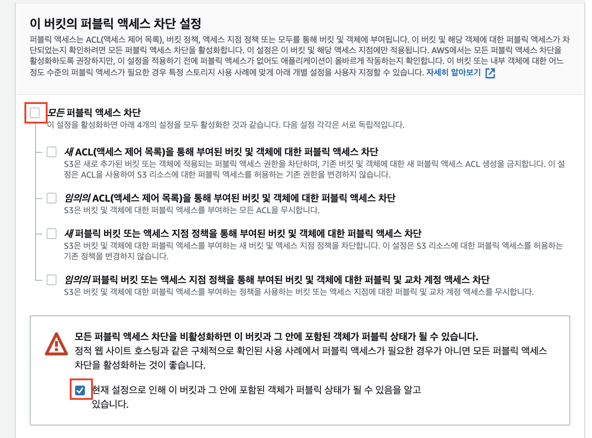
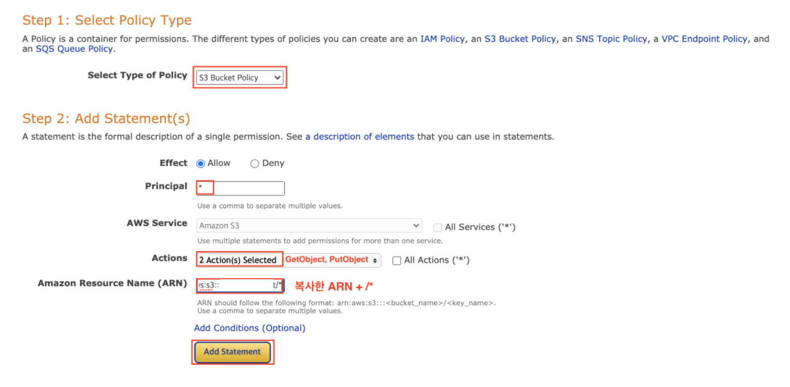
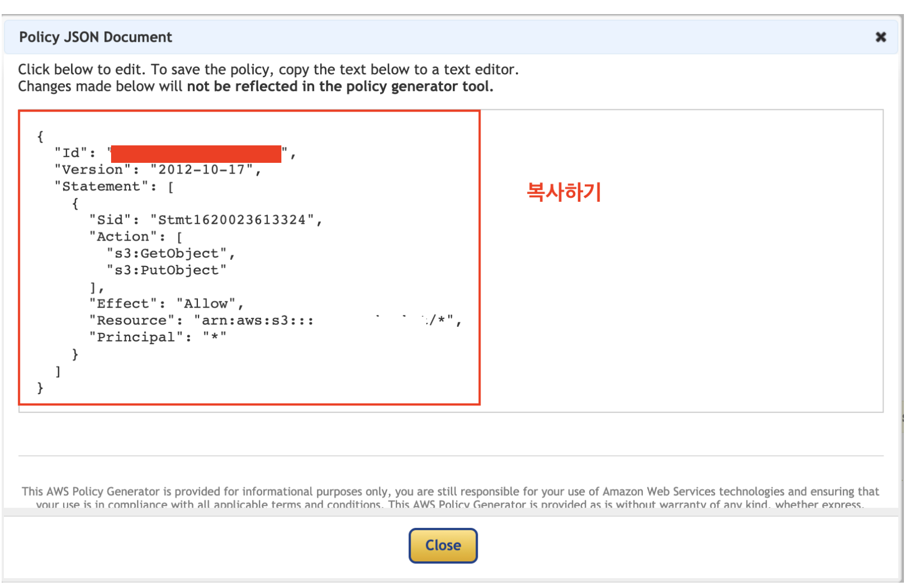
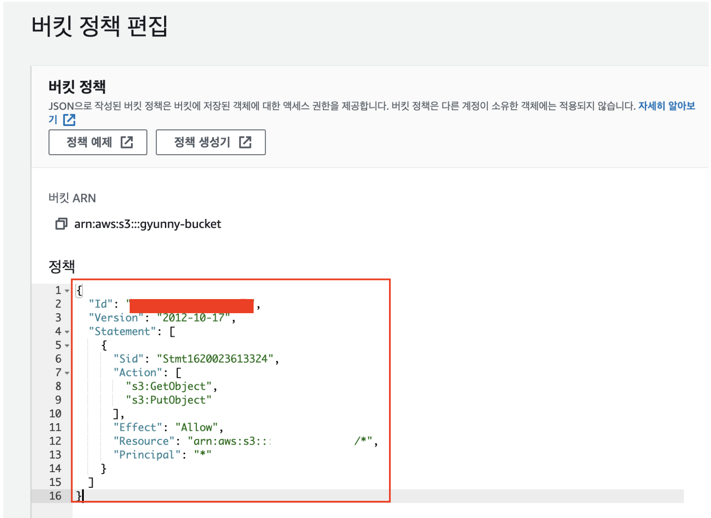
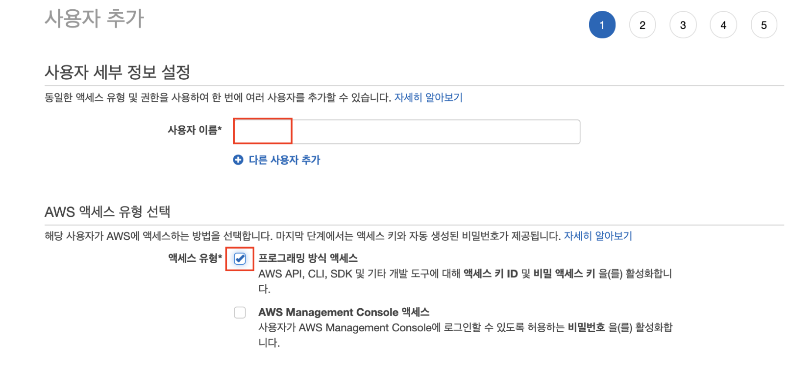
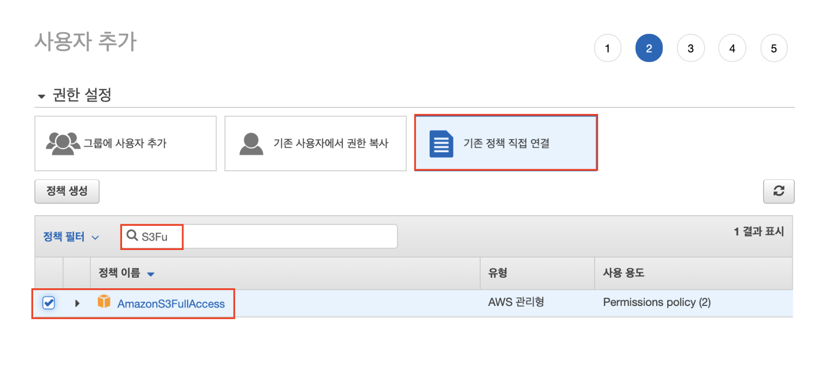
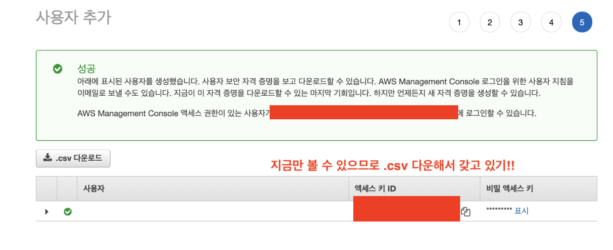
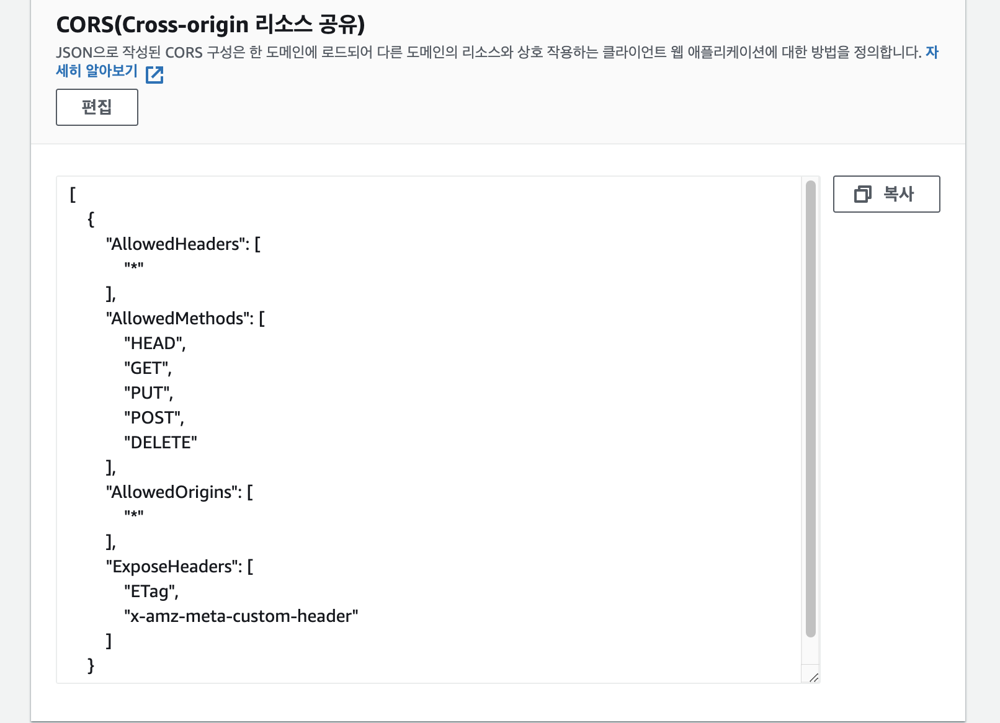

# S3

### 1. AWS Bucket 생성

### 2. 권한 탭에 들어가서 버킷 정책 변경

- principal: *를 입력하기
- Actions: GetObject, PutObject 선택
- ARN: 위에 있던 복사 + /*

- 잘 입력됐는지 확인하고 Generate Policy

- 생성된 JSON Document 복사하기

- 정책에 붙여넣기

### IAM 사용자 권한 추가

- S3에 접근 권한 부여

  

- 엑세스 키랑 비밀 엑세스 키 복사해두기

### CORS 설정

